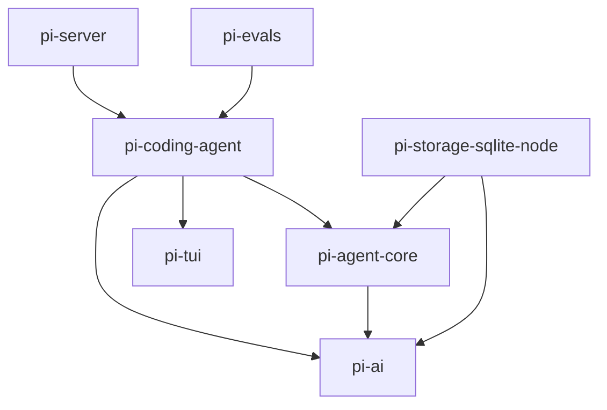
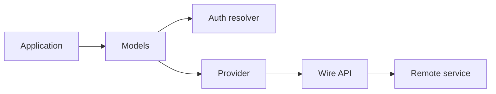
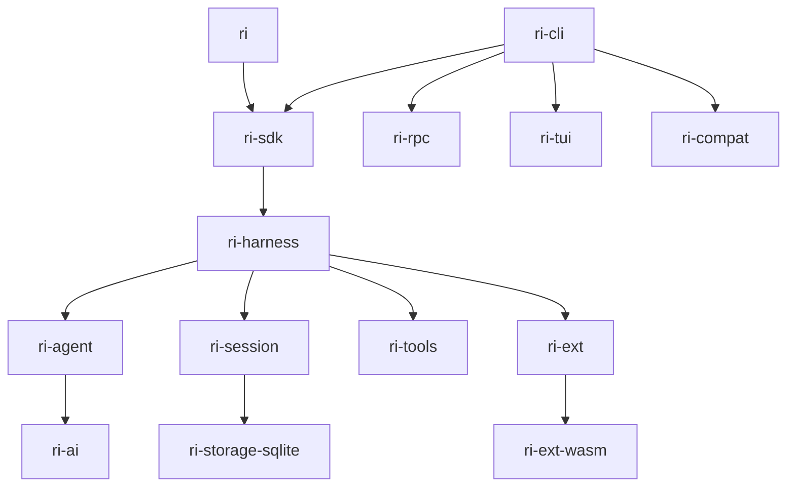

# Pi 参考实现架构与 Rust 移植基线

本文档是 `ri-agent` Rust 实现的行为规格。它描述 Pi 参考仓库的实际组成、控制流、可观察契约、已知实现差异，以及 Rust 侧需要保持的兼容边界。

## 1. 基线与调研方法

- 参考仓库：`ref/pi`
- 参考提交：`518855dd502220d0c6480fb8863e2e7f8799893f`
- 包版本：`0.82.0`
- 主要证据优先级：
  1. 源码和类型定义
  2. 自动化测试与 regression tests
  3. 协议文档和 SDK examples
  4. README
  5. 仅描述未来设计的文档

调研覆盖：

- `ref/pi/packages/ai`
- `ref/pi/packages/agent`
- `ref/pi/packages/storage/sqlite-node`
- `ref/pi/packages/coding-agent`
- `ref/pi/packages/tui`
- `ref/pi/packages/server`
- `ref/pi/packages/evals`

参考实现约有：

- `pi-ai`：169 个源码文件、114 个测试文件
- `pi-agent-core`：35 个源码文件、18 个测试文件
- `pi-coding-agent`：177 个源码文件、183 个测试文件
- `pi-tui`：28 个源码文件、27 个测试文件
- 全仓库约 343 个 `*.test.ts`，另有脚本测试与真实模型 eval

### 1.1 “已实现”与“设计中”的边界

参考仓库当前同时存在两套重叠的高层栈：

1. `packages/coding-agent` 的 `AgentSession`
   - 是当前 CLI、SDK、RPC 和 TUI 实际使用的生产路径。
   - 包含完整的 retry、auto-compaction、extension、session replacement 和 UI 集成。
2. `packages/agent/src/harness` 的 `AgentHarness`
   - 是新的通用 Harness 方向。
   - 已实现 turn snapshot、save point、session storage traits、部分 hooks、资源、工具和 compaction。
   - `packages/agent/docs/agent-harness.md` 仍明确列有未完成的 auto-compaction、retry、hook facade、durable recovery 和 lifecycle hardening。

Rust 实现不会逐行复制这两套重复代码。它使用一个规范化 Harness：

- 以 `AgentSession` 的现行可观察行为为完整功能基线；
- 采用 `AgentHarness` 已经被测试证明的 turn snapshot、save point、storage trait 和错误边界；
- 不把参考仓库文档中的未来 TODO 冒充成 Pi 已有功能；
- 不保留仅用于迁移期的内部重复层。

## 2. 包结构与依赖关系



### 2.1 `pi-ai`

统一 LLM API，负责：

- 消息和内容块类型
- 模型与 Provider 目录
- Provider-owned auth
- wire protocol 适配
- 流式事件
- reasoning/thinking
- 工具 schema 与 constrained sampling
- token、usage 和 cost
- cache/session affinity
- 图像输入与图像生成

核心入口保持无副作用。内置 Provider、wire API、OAuth 和兼容层通过显式子路径加载。

关键文件：

- `ref/pi/packages/ai/src/types.ts`
- `ref/pi/packages/ai/src/models.ts`
- `ref/pi/packages/ai/src/images-models.ts`
- `ref/pi/packages/ai/src/api/`
- `ref/pi/packages/ai/src/providers/`
- `ref/pi/packages/ai/src/auth/`
- `ref/pi/packages/ai/src/utils/event-stream.ts`

### 2.2 `pi-agent-core`

通用 Agent runtime，负责：

- 低层 agent loop
- stateful `Agent`
- tool execution
- steering/follow-up
- Agent events
- abort 与 idle barrier
- 通用 Harness、Session storage traits、compaction、skills 和基础工具

关键文件：

- `ref/pi/packages/agent/src/agent-loop.ts`
- `ref/pi/packages/agent/src/agent.ts`
- `ref/pi/packages/agent/src/types.ts`
- `ref/pi/packages/agent/src/harness/agent-harness.ts`
- `ref/pi/packages/agent/src/harness/types.ts`

### 2.3 `pi-coding-agent`

当前完整 Coding Agent 产品层，负责：

- SDK factory
- `AgentSession`
- `AgentSessionRuntime`
- JSONL SessionManager
- ModelRuntime
- settings 与 project trust
- resource loader
- 7 个 coding tools
- extension system
- prompt templates 与 skills
- auto retry 和 auto compaction
- interactive/print/json/rpc 四种运行模式

关键文件：

- `ref/pi/packages/coding-agent/src/core/sdk.ts`
- `ref/pi/packages/coding-agent/src/core/agent-session.ts`
- `ref/pi/packages/coding-agent/src/core/agent-session-runtime.ts`
- `ref/pi/packages/coding-agent/src/core/session-manager.ts`
- `ref/pi/packages/coding-agent/src/core/extensions/`
- `ref/pi/packages/coding-agent/src/core/tools/`
- `ref/pi/packages/coding-agent/src/modes/`

### 2.4 `pi-tui`

内联终端 UI 框架，负责：

- 组件树
- 行级差分渲染
- CSI 2026 synchronized output
- overlay/focus
- editor/input/select/markdown
- Kitty keyboard protocol
- Kitty/iTerm2 图像
- ANSI/CJK 宽度处理

关键文件：

- `ref/pi/packages/tui/src/tui.ts`
- `ref/pi/packages/tui/src/terminal.ts`
- `ref/pi/packages/tui/src/components/editor.ts`
- `ref/pi/packages/tui/src/keys.ts`

### 2.5 Storage、Server 与 Evals

- `pi-storage-sqlite-node` 为新 Harness Session trait 提供 SQLite backend。
- `pi-server` 是实验性 Unix socket supervisor，管理多个 `pi --mode rpc` 子进程。
- `pi-evals` 是开发期真实模型行为评测，不是运行时依赖。

本轮 Rust 用户栈实现 SQLite backend，但不实现实验性 server/eval runner。

## 3. AI 层

## 3.1 消息模型

核心消息：

- `UserMessage`
- `AssistantMessage`
- `ToolResultMessage`

核心内容块：

- `TextContent`
- `ThinkingContent`
- `ImageContent`
- `ToolCall`

`AssistantMessage` 还携带：

- `api`
- `provider`
- `model`
- 可选 `responseModel`
- 可选 `responseId`
- `usage`
- `stopReason`
- 可选 `errorMessage`
- 可选 diagnostics

停止原因：

- `stop`
- `length`
- `toolUse`
- `error`
- `aborted`

这些类型是普通可序列化数据。模型对象同样不附带函数，因此可以直接持久化模型引用和 RPC payload。

## 3.2 流式事件

标准事件：

- `start`
- `text_start`
- `text_delta`
- `text_end`
- `thinking_start`
- `thinking_delta`
- `thinking_end`
- `toolcall_start`
- `toolcall_delta`
- `toolcall_end`
- `done`
- `error`

关键契约：

1. `stream()` 同步返回事件流；auth、lazy load 和请求 setup 在流内部异步执行。
2. 请求失败不能在返回流后向调用方 throw，必须形成 `error` 事件和最终错误消息。
3. `result()` 在 `done` 或 `error` 后返回最终 `AssistantMessage`。
4. text、thinking、tool call 块可能交错。
5. `contentIndex` 是最终 `message.content` 的数组下标，不是各内容类型独立计数。
6. abort 保留已经产生的部分内容和部分 usage。

## 3.3 Models、Provider 与 API 三层



### Models

`Models` 是运行时 Provider collection：

- `getProviders`
- `getProvider`
- `getModels`
- `getModel`
- `refresh`
- `getAuth`
- `login`
- `logout`
- `stream`
- `complete`
- `streamSimple`
- `completeSimple`

模型目录读是同步的“last known”读；动态刷新是显式 async 操作。

### Provider

Provider 拥有：

- id/name/base URL
- auth 方法
- 模型列表
- 可选动态刷新
- stream dispatch

一个 Provider 可以混用多个 wire API。`github-copilot`、`opencode`、`fireworks`、`cloudflare-ai-gateway`、`xai` 等都依赖按 `model.api` 的混合路由。

### API

API 实现是可复用的 wire protocol adapter。每个实现统一提供：

- `stream`
- `streamSimple`

API 层负责：

- Context 到上游 payload 的转换
- tools/schema 转换
- SSE/WS/SDK 事件解析
- usage/cost 归一化
- Provider error 归一化
- API 级 retry

## 3.4 Wire API

聊天/Agent API：

1. `anthropic-messages`
2. `openai-completions`
3. `openai-responses`
4. `openai-codex-responses`
5. `azure-openai-responses`
6. `google-generative-ai`
7. `google-vertex`
8. `mistral-conversations`
9. `bedrock-converse-stream`
10. `pi-messages`

图像生成 API：

11. `openrouter-images`

Codex 额外支持：

- SSE
- WebSocket
- cached WebSocket
- auto transport
- 按 sessionId 复用连接
- 5 分钟 idle 清理

## 3.5 内置 Provider

参考提交中的 Provider 包括：

- amazon-bedrock
- ant-ling
- anthropic
- azure-openai-responses
- cerebras
- cloudflare-ai-gateway
- cloudflare-workers-ai
- deepseek
- fireworks
- github-copilot
- google
- google-vertex
- groq
- huggingface
- kimi-coding
- minimax
- minimax-cn
- mistral
- moonshotai
- moonshotai-cn
- nvidia
- openai
- openai-codex
- opencode
- opencode-go
- openrouter
- qwen-token-plan
- qwen-token-plan-cn
- radius
- together
- vercel-ai-gateway
- xai
- xiaomi
- xiaomi-token-plan-ams
- xiaomi-token-plan-cn
- xiaomi-token-plan-sgp
- zai
- zai-coding-cn

其中 Radius 是当前唯一主要依赖手写动态模型目录的内置 Provider；大部分 Provider 使用生成的静态 catalog。

## 3.6 Auth 与 CredentialStore

凭证类型：

- `api_key`
- `oauth`

CredentialStore 的写入必须通过序列化的 read-modify-write：

- `read`
- `list`
- `modify`
- `delete`

解析顺序：

1. 显式 request override
2. stored credential
3. ambient environment/ADC/AWS chain

重要不变量：

- stored credential 一旦存在，就拥有该 Provider。
- stored credential 类型不匹配或 OAuth refresh 失败时，不能静默退回环境变量。
- OAuth refresh 在 `modify` 锁内 double-check，避免并发 double refresh。
- refresh 失败保留旧 credential，供重新登录或重试。
- header 合并大小写不敏感。

最终 header 顺序：

```text
provider auth -> model headers -> explicit request headers -> transformHeaders
```

支持的 OAuth 流包括：

- Anthropic
- OpenAI Codex
- GitHub Copilot
- OpenRouter
- Kimi Coding
- xAI
- Radius

交互抽象包含：

- text
- secret
- select
- manual code
- auth URL
- device code
- progress

## 3.7 跨 Provider Context 转换

`transformMessages()` 是 Provider handoff 的核心。

实际实现行为：

1. `null` content 归一化为空内容。
2. 非视觉模型遇到图片时，用文本占位。
3. 同模型、同 API 的 thinking/signature 尽量保留。
4. 跨模型 thinking 转为普通文本。
5. 跨模型签名被移除。
6. tool call id 可被归一化，并同步重写对应 tool result id。
7. 被 user 消息打断的 orphan tool call 自动补一个错误 tool result：
   - `isError: true`
   - 文本 `"No result provided"`
8. error/aborted assistant 消息在上游 replay 转换时被跳过。

README 曾描述跨 Provider thinking 使用 `<thinking>` 标签，但当前实现使用普通文本，并明确避免标签诱导模型模仿。Rust 以实现和测试为准。

## 3.8 Tool Schema 与增量参数

Pi 使用 JSON Schema 定义工具。

能力包括：

- 工具查找
- 参数 coercion 与 validation
- streaming partial JSON
- JSON repair
- strict JSON schema
- OpenAI grammar tools
- deferred tools

`toolcall_delta` 中的 arguments：

- 始终至少为 `{}`；
- 可能缺字段；
- string、array、nested object 都可能不完整；
- Google 通常一次给出完整 function call，而不是逐字段流式输出。

Constrained sampling：

- `strict: prefer`：支持时严格，不支持则回退普通 tool calling。
- `strict: require`：Provider/模型不支持时请求失败。
- OpenAI grammar 支持 Lark/regex，并要求单个 required string 参数。

## 3.9 Thinking、Cache 与 Usage

统一 reasoning level：

- off
- minimal
- low
- medium
- high
- xhigh
- max

Provider-specific options 仍保留，统一接口负责 level 映射、token budget 与 max token clamp。

Cache：

- none
- short
- long

Session affinity 可能使用：

- `prompt_cache_key`
- `session_id`
- `x-client-request-id`
- `x-session-affinity`
- `x-session-id`
- Provider-specific cache control block

Usage：

- input
- output
- cacheRead
- cacheWrite
- 可选 cacheWrite1h
- 可选 reasoning
- totalTokens
- cost breakdown

Cost 支持 tier pricing 和 Anthropic 长缓存写入规则。

## 3.10 Error、Retry 与 Overflow

两层 retry：

1. Provider transport retry
   - 429
   - 5xx
   - 网络中断
   - Retry-After 和 delay cap
2. AgentSession assistant retry
   - 根据标准化后的 AssistantMessage 错误分类
   - 与 context overflow 恢复互斥

Overflow 检测不仅依赖 HTTP code，还包含 Provider-specific 字符串和 usage 规则，例如：

- z.ai 静默超窗
- Xiaomi 截断
- rate-limit 文本排除

## 3.11 图像

聊天输入：

- user image
- tool result image
- 非视觉模型文本降级

图像生成：

- 独立 `ImagesModels`
- 当前内置为 OpenRouter Images
- one-shot `generateImages`
- 失败返回 `AssistantImages { stopReason: error }`，不 reject

## 4. Agent Loop

## 4.1 Agent 与 AgentMessage

Agent 层允许应用扩展消息类型。进入 LLM 前：

```text
AgentMessage[]
  -> transformContext
  -> convertToLlm
  -> Message[]
  -> Provider
```

`transformContext` 在 AgentMessage 层运行，用于压缩、过滤和外部上下文注入。

`convertToLlm` 负责：

- 保留 user/assistant/toolResult
- 过滤 UI-only 消息
- 将 bash/custom/summary 等应用消息投影为 LLM 消息

## 4.2 基本事件序

无工具：

```text
agent_start
turn_start
message_start(user)
message_end(user)
message_start(assistant)
message_update*
message_end(assistant)
turn_end
agent_end
```

有工具：

```text
assistant message_end
tool_execution_start*
tool_execution_update*
tool_execution_end*
message_start(toolResult)
message_end(toolResult)
turn_end
next turn_start
```

`Agent.subscribe()` listener：

- 按注册顺序执行；
- 每个 listener 都被 await；
- `agent_end` 事件不是 prompt resolve 的提前点；
- `prompt()`、`waitForIdle()` 和 `isStreaming=false` 都要等 `agent_end` listener 完成。

## 4.3 双层 Loop

内层继续条件：

- assistant 发出 tool calls
- steering queue 非空

外层继续条件：

- follow-up queue 非空

安全点：

1. 完成 assistant stream。
2. 完成当前批次全部工具。
3. 发出 turn_end。
4. 执行 prepare-next-turn/save-point。
5. 检查 should-stop。
6. drain steering。
7. 内层自然结束后再 drain follow-up。

`shouldStopAfterTurn=true` 时必须直接结束，不能继续 poll steering/follow-up。

## 4.4 Tool Pipeline

预检顺序：

1. 按名称查工具。
2. `prepareArguments`。
3. schema validation。
4. `beforeToolCall`。
5. block 或 execute。

参考实现允许 `beforeToolCall` 原地改变已经验证过的参数，且不再次验证。这是可观察兼容行为，也是扩展作者承担的安全边界。

并行模式：

- 所有 preflight 按 assistant 源顺序执行；
- `tool_execution_start` 按源顺序；
- 工具并发执行；
- `tool_execution_end` 按完成顺序；
- tool result messages 按源顺序；
- `turn_end.toolResults` 按源顺序。

只要同批任一工具声明 sequential，整批顺序执行。

`stopReason=length`：

- 不执行任何截断的 tool call；
- 为这些 call 生成错误结果；
- loop 可继续，让模型重新发出调用。

`terminate=true`：

- 只有该批所有最终结果均为 terminate 时才阻止自动下一轮。

工具 update：

- execute 完成前有效；
- execute 完成后的 late update 被忽略；
- 结束前等待已接收 update 事件 settle。

## 4.5 Steering 与 Follow-up

Steering：

- 当前 assistant turn 的工具全部结束后注入；
- 在下一次 Provider 请求前进入 context。

Follow-up：

- 无 tool、无 steering、Agent 原本将停止时注入。

Queue mode：

- all
- one-at-a-time

`continue()` 从 assistant 尾恢复时：

1. steering 优先；
2. steering 空时才处理 follow-up。

## 4.6 Abort 与错误

- abort signal 传到 Provider、tools 和 extension handler。
- Agent 无 active run 时 abort 是 no-op。
- Provider stream 错误形成 AssistantMessage。
- 高层意外 throw 仍应形成完整 failure lifecycle，避免 UI/Session 永远处于 busy。

## 5. Harness 与 Coding Session

## 5.1 统一生命周期

当前 `AgentSession` 的高层循环：

```text
prompt
  -> preflight
  -> optional pre-prompt compaction
  -> Agent run
  -> retryable error?
  -> overflow compaction?
  -> queued continuation?
  -> agent_settled
```

四种运行模式都复用同一 `AgentSessionRuntime`。模式层只能绑定 I/O、UI 或协议，不能复制业务状态机。

## 5.2 Prompt 管道

顺序必须保持：

1. extension command 检测
2. input extension event
3. skill command 展开
4. prompt template 展开
5. streaming queue 规则
6. model/auth 检查
7. pre-prompt compaction
8. pending next-turn messages
9. `before_agent_start`
10. system prompt override
11. Agent run

Extension command 在 streaming 期间也可以立即执行；普通 prompt 在 streaming 时必须显式指定 steer 或 follow-up。

## 5.3 Turn Snapshot 与 Save Point

新 Harness 已实现并验证的设计：

- 每个 turn 创建固定 snapshot；
- snapshot 包含 model、thinking、tools、active tools、context、resources、system prompt、stream options、session id；
- turn 进行中修改 runtime config，只影响下一 turn；
- Provider request 不读取一半更新的新配置；
- 每个 save point 先持久化 Agent 产生的 message，再 flush extension/session pending writes；
- 然后创建下一 turn snapshot。

Rust 采用这一模型，解决现行 Coding Session 中多个动态 getter 和 mutation 时序的复杂度。

## 5.4 Retry

Agent turn retry：

- 默认最多 3 次；
- 默认 base delay 2000ms；
- exponential backoff；
- overflow 不走普通 retry；
- retry 前从内存 Agent context 移除错误 assistant；
- 已持久化 Session entry 保留；
- `agent_end` 带 `willRetry`；
- 最终无 retry/compaction/queue 时才发 `agent_settled`。

Provider transport retry 是独立层，参数包括 timeout、max retries 和 max retry delay。

## 5.5 Auto Compaction

默认设置：

- enabled: true
- reserveTokens: 16384
- keepRecentTokens: 20000

阈值：

```text
contextTokens > contextWindow - reserveTokens
```

触发原因：

- manual
- threshold
- overflow

Overflow 特殊规则：

- 切换 model 后不能用旧 model usage 判定新 model overflow；
- compaction 边界前的 stale usage 不能触发再次压缩；
- zero/error usage 时使用估算；
- overflow recovery 每次 prompt 最多一次；
- retry 前从 Agent context 移除 overflow error assistant，但 Session 可保留；
- 成功 completion 已超窗时可压缩，但不能从 assistant 尾错误地 continue。

## 5.6 Compaction 算法

1. 从后向前累计 token。
2. 尽量在 turn boundary 切分。
3. 不在 tool result 中间切分。
4. 保留最近 `keepRecentTokens`。
5. 总结旧上下文。
6. 累积 read/modified file tracking。
7. 写入 compaction entry。
8. 用 summary + retained tail 重建 context。

单个 turn 本身超预算时形成 split turn：

- history summary
- turn prefix summary
- 合并后保留 turn 尾部

Summary 序列化：

- `[User]`
- `[Assistant thinking]`
- `[Assistant]`
- `[Assistant tool calls]`
- `[Tool result]`

tool result 在 summary 请求中截到 2000 字符。

## 5.7 Branch Summary

Tree navigation：

1. 找旧 leaf 和目标 leaf 的最近公共祖先。
2. 收集被离开的 branch。
3. 按 token budget 从新到旧准备。
4. 可由 extension cancel 或覆盖 summary。
5. 写 branch summary。
6. 更新 durable leaf。

Branch summary 与 compaction 共用 file operation tracking 和 summarization retry。

## 6. Session 与存储

## 6.1 Coding Agent JSONL v3

Header：

- type
- version
- id
- timestamp
- cwd
- 可选 parentSession

Tree entry 基础字段：

- type
- id
- parentId
- timestamp

Entry 类型：

- message
- model_change
- thinking_level_change
- compaction
- branch_summary
- custom
- custom_message
- label
- session_info

Session v1-v3 自动迁移：

- v1 线性序列
- v2 parentId 树
- v3 hookMessage 重命名为 custom

## 6.2 新 Harness Session

新 Session trait 增加：

- active_tools_change
- leaf entry
- storage metadata
- entry sequence
- cursor pagination
- materialized stats

leaf 不是仅内存 cursor。`setLeafId()` 必须追加 durable leaf entry，重开后从最后一个 leaf-affecting entry 恢复。

## 6.3 Context 构建

`buildContextEntries()`：

1. 从 leaf 回溯 active path。
2. 应用最新 compaction checkpoint。
3. 使用 retainedTail，或兼容旧 firstKeptEntryId。
4. 保留 compaction 后 entries。
5. custom entry 默认不进入 LLM context。
6. custom message、branch summary 和 compaction summary 投影为 AgentMessage。

## 6.4 Storage Trait

能力包括：

- metadata
- leaf
- entry id
- append/get/find
- labels/name/stats
- path to root or compaction
- ordered cursor reads
- create/open/list/delete/fork

Backend：

- in-memory
- JSONL
- SQLite

## 6.5 SQLite

主要表：

- sessions
- session_entries
- session_sequences
- branch_entries
- session_materialized
- entry_materialized

关键 PRAGMA：

- `journal_mode=WAL`
- `synchronous=FULL`
- `busy_timeout=5000`

一次 append transaction 同时完成：

1. 分配 sequence。
2. 插入 entry。
3. 推进 sequence。
4. 更新 session materialized state。
5. 更新 entry materialized state。
6. 更新 active leaf。
7. 增量或全量重建 active branch。

事务失败时内存 cache 和数据库必须一起回滚。

Malformed entry 的行为：

- 单个坏 JSON entry 可跳过；
- 关键 materialized summary 损坏应报 invalid session；
- 缺失 materialized row 应报 invalid session。

## 7. 内置工具

默认激活：

- read
- bash
- edit
- write

可选内置：

- grep
- find
- ls

## 7.1 统一截断规则

- 默认最多 2000 行。
- 默认最多 50 KiB。
- read/grep/find/ls 保留头部。
- bash 保留尾部。
- grep 单行最多 500 字符。
- bash tail 是唯一允许保留 partial line 的普通路径。
- 完整 shell 输出可 spill 到临时文件，并返回 fullOutputPath。

## 7.2 Read

- 1-based offset。
- 可选 limit。
- 文本与图像读取。
- 图片 MIME 检测、缩放与 vision 能力处理。
- 输出后提供续读 offset 提示。
- 可插拔 ReadOperations，支持远程 FS。

## 7.3 Write

- 自动创建父目录。
- UTF-8 写入。
- 支持流式预览。
- 与 edit 共享按 canonical path 的文件 mutation queue。

## 7.4 Edit

- 支持多个 edits。
- 所有匹配基于原始文件，不是前一个 edit 的临时结果。
- 兼容 legacy oldText/newText。
- 支持 BOM、CRLF 和空白归一化 fuzzy match。
- 返回 UI diff 和标准 unified patch。

## 7.5 Bash

- 流式 stdout/stderr。
- 100ms 左右节流 UI update。
- timeout 与 abort。
- Windows 进程树终止。
- 可替换 spawn hook 和 operations。
- 可暴露 Session/Provider/Model/Reasoning 环境变量。

## 7.6 Grep、Find 与 Ls

Grep：

- 使用 ripgrep。
- 尊重 ignore。
- 支持 context。
- 默认最多 100 matches。

Find：

- 使用 fd。
- glob 模式。
- 忽略 `.git` 和 `node_modules`。
- 默认最多 1000 entries。

Ls：

- 包含 dotfiles。
- 目录加 `/`。
- 大小写不敏感排序。
- 默认最多 500 entries。

## 8. Skills、Prompts 与 System Prompt

## 8.1 Skills

Pi 实现 Agent Skills 标准，并对大部分格式问题采取 warning-but-load。

发现位置：

- global `.pi/agent/skills`
- global `.agents/skills`
- project `.pi/skills`
- project/ancestor `.agents/skills`
- packages
- settings
- CLI explicit path

规则：

- 含 `SKILL.md` 的目录是一个 skill root，不继续向下找嵌套 skill。
- 某些 root 允许直接 `.md`。
- 隐藏目录和 `node_modules` 被跳过。
- 支持 `.gitignore`、`.ignore`、`.fdignore`。
- description 缺失时不加载。
- 名称冲突 first wins，并产生 diagnostic。
- `disable-model-invocation=true` 时不出现在 system prompt，但可显式 `/skill:name`。

System prompt 只注入：

- name
- description
- location

完整 skill 内容由 read 工具按需读取，实现 progressive disclosure。

显式调用：

```text
<skill name="..." location="...">
...
</skill>
```

## 8.2 Prompt Templates

- global prompts
- project prompts
- package/settings/CLI paths
- 目录只读直接 `.md`，不递归
- 文件名是 command name
- frontmatter 支持 description 和 argument hint

参数替换包括：

- `$1` 等 positional
- `$@`
- `$ARGUMENTS`
- `${@:N}`
- `${@:N:L}`

Extension command 先于 prompt template 解析。

## 8.3 Context Files

候选：

- AGENTS.md
- AGENTS.MD
- CLAUDE.md
- CLAUDE.MD

加载：

1. global context file
2. 从 filesystem/repo root 到 cwd 的 project context chain

Project context、project extensions 和 project settings 都受 trust gate 约束。

## 8.4 SYSTEM 与 APPEND_SYSTEM

- SYSTEM 替换默认 prompt body。
- APPEND_SYSTEM 追加。
- project 文件只在 trusted project 加载。
- 即使自定义 SYSTEM，context、skills 和 cwd 仍按规则附加。

## 8.5 System Prompt 结构

1. agent role
2. active tool snippets
3. coding guidelines
4. tool-specific guidelines
5. Pi docs path
6. project context
7. available skills
8. current working directory

只有声明 prompt snippet 的工具进入工具摘要。

## 9. 扩展系统

## 9.1 当前加载模型

TypeScript 扩展是 async factory：

```text
ExtensionFactory(ExtensionAPI)
```

Node/dev 使用 jiti 动态加载 TypeScript；Bun binary 使用 virtual modules 注入打包的 Pi 模块。

发现：

1. 直接 `.ts`/`.js`
2. 子目录 `index.ts`/`index.js`
3. package manifest 中的 extension entries

复杂目录不做无限递归。

## 9.2 Extension API

注册：

- event handler
- tool
- command
- shortcut
- flag
- Provider
- message renderer
- entry renderer

动作：

- send message
- send user message
- append custom entry
- session name
- label
- active tools
- model
- thinking level
- exec
- event bus

Context：

- mode
- cwd
- trust status
- UI
- Session facade
- Model registry
- active model/thinking
- cancellation signal
- compact
- shutdown
- reload
- new/switch/fork/navigate session

## 9.3 事件

Startup/resource：

- project_trust
- resources_discover

Session：

- session_start
- session_info_changed
- session_before_switch
- session_before_fork
- session_before_compact
- session_compact
- session_before_tree
- session_tree
- session_shutdown

Agent：

- before_agent_start
- agent_start
- agent_end
- agent_settled
- turn_start
- turn_end
- message_start
- message_update
- message_end
- context
- before_provider_headers
- before_provider_request
- after_provider_response

Tool/input/model：

- tool_call
- tool_result
- tool_execution_start
- tool_execution_update
- tool_execution_end
- user_bash
- input
- model_select
- thinking_level_select

## 9.4 Reducer 语义

不是所有事件都是广播通知。必须保留以下 reducer：

- context：按 handler 顺序 transform messages。
- before provider request/payload/headers：后 handler 看见前 handler 输出。
- before agent start：收集 injected messages，并链式修改 system prompt。
- tool call：按顺序，首个 block 立即结束。
- tool result：按顺序累积 patch。
- session-before：首个 cancel 提前结束，否则最后一个有效 override 生效。
- input：transform chain，handled 提前结束。
- user bash：首个 meaningful result 生效。
- message end：替换消息时 role 必须一致。

Extension handler 错误：

- 形成 extension_error；
- 默认不阻止其他扩展；
- control-plane hook 的明确 block/cancel 仍生效。

## 9.5 冲突与生命周期

- tool/flag：first wins，并报告 collision。
- command：重名时生成可区分 invocation name。
- shortcut：保留内置绑定；扩展间后注册覆盖并 warning。
- Provider 在 load 阶段先排队，bind model runtime 后 flush。
- reload 或 session replacement 后旧 context 必须失效。
- 旧 context 的动作调用必须明确报 stale，而不是作用到新 Session。
- `session_shutdown` 在 invalidate 之前完成。

## 9.6 Rust/WASM 决策

Rust 实现使用：

- 内嵌扩展：原生 Rust `Extension` trait。
- 动态扩展：WASM Component Model。
- 两者共享同一 descriptor、event reducer 和 capability facade。
- 不兼容执行现有 TypeScript 源文件。

WASM capability：

- filesystem
- network
- process
- UI
- Session
- Provider
- event bus

默认不继承 ambient host 权限。package manifest 显式声明能力；host 设置 fuel、内存和 deadline。

跨 WASM 的自定义 UI 使用声明式 view tree 和 action event，不传递 host object pointer。

## 10. Settings、Trust 与 Package

Settings：

- global 与 project 分层。
- project 覆盖 global。
- nested object key merge。
- setter 异步持久化。
- `flush()` 是 durability boundary。
- I/O error 进入 error queue，不直接污染 stdout。

Project Trust：

- 先只加载全局/CLI trust extensions。
- extension 可给 yes/no/undecided。
- 首个 yes/no 生效。
- 可选择 remember。
- 无 handler 决策时再应用 saved/default/built-in prompt。

Package resource precedence：

1. project settings
2. project auto-discovery
3. user settings
4. user auto-discovery
5. package origin

资源 collision 采用 first wins，并保存 provenance/diagnostic。

Rust 原生包：

- 配置根目录 `.ri`
- manifest `ri-package.toml`
- 动态组件为 versioned WASM Component
- local/git/https source
- lock/checksum
- include/exclude filters
- project/global scope
- trust gate
- reload 与 stale context

## 11. CLI、RPC 与 TUI

## 11.1 运行模式

- interactive
- print text
- print JSON
- RPC
- in-process SDK

模式判定考虑：

- 显式 mode
- print flag
- stdin/stdout TTY
- piped stdin

所有模式共享 Session/Harness，不复制 prompt、retry、compaction 或 extension 逻辑。

## 11.2 RPC

严格 JSONL：

- 仅 LF 是 record delimiter。
- 输入可剥离 LF 前的 CR。
- JSON 字符串中的 U+2028/U+2029 不是 delimiter。

Command：

- prompt
- steer
- follow_up
- abort
- new_session
- get_state
- get_messages
- set/cycle/list model
- set/cycle/list thinking level
- set queue mode
- compact
- set auto compaction
- set auto retry
- abort retry
- bash
- abort bash
- session stats
- export
- switch
- fork
- clone
- entries/tree
- last assistant text
- session name
- commands

Response：

```text
type=response
id?
command
success
data?
error?
```

AgentSessionEvent 直接作为独立 JSONL 行输出。

Prompt response 表示：

- accepted
- queued
- immediately handled

运行中稍后的 Provider 失败不能为同一 request id 再发第二个失败 response，而应通过事件和 message 报告。

Extension UI 子协议：

- select
- confirm
- input
- editor
- notify
- status
- widget
- title
- editor text

## 11.3 TUI

组件接口：

- render(width) -> lines
- handle input
- invalidate
- optional focus

每个 line 的 visible width 不能超过传入 width。

差分策略：

1. 首次 render 直接输出。
2. width/某些 height 变化时 full redraw。
3. 正常情况找到 first/last changed line。
4. 只移动到变化处并清除/重绘必要范围。
5. 用 CSI 2026 包裹原子更新。
6. 图像 reserved rows 参与 diff 范围。

Overlay：

- anchor/absolute/percentage
- min width/max height
- margin/offset
- responsive visibility
- capturing/non-capturing
- focus restore

输入：

- raw mode
- bracketed paste
- Kitty keyboard protocol
- modifyOtherKeys fallback
- stdin frame buffer
- Windows VT input
- macOS modifier helper
- exit drain

Editor：

- multiline
- grapheme/word navigation
- undo stack
- kill ring
- paste marker
- autocomplete
- viewport scrolling
- IME cursor marker

## 12. 测试行为基线

## 12.1 测试层级

T0：纯转换

- message transform
- schema
- partial JSON
- model compatibility
- compaction cut point
- token estimate
- session migration

T1：脚本化 Agent

- provider response script
- Agent event trace
- tools
- queue
- retry
- compaction
- Session output

T2：Wire protocol

- outbound HTTP body
- headers
- SSE/WS chunking
- malformed/partial payload
- usage
- error body
- retry/abort

T3：Session/RPC

- JSONL framing
- command/response
- event sequence
- migration
- import/export

T4：Live contracts

- real Provider
- OAuth
- cache affinity
- thinking signature
- Bedrock
- platform shell

## 12.2 不可仅靠脚本 Provider 证明的行为

- SSE/WS 任意 chunk boundary
- Provider-specific reasoning replay
- cache affinity
- OAuth callback/device code
- DNS/proxy/timeout 分类
- Windows process tree
- SQLite locks/migrations
- TUI CJK/terminal behavior
- release binary 的真实请求

脚本 Provider 只能存在于测试支撑，不得成为生产 fallback。

## 12.3 必须锁定的竞态

1. tool end 完成顺序与 tool result 源顺序不同。
2. assistant `message_end` 在 tool preflight 前已经持久化。
3. async listeners 按顺序 await。
4. `agent_settled` 晚于 retry、compaction 和 queued continuation。
5. active tool/config 更新只影响下一 Provider request。
6. late tool update 被忽略。
7. abort 不丢失已接受的 pending Session writes。
8. SQLite append 失败同时回滚 DB 与内存 materialization。
9. session replacement 先 shutdown、再 invalidate、再 bind 新 runtime。

## 13. Rust Workspace 映射



Crate 职责：

- `ri-ai`：统一 AI 数据模型、stream、auth、Provider、wire API、catalog、images。
- `ri-agent`：低层 loop、Agent、events、tool trait、queue/cancel。
- `ri-session`：append-only tree、JSONL/memory repository、context projection。
- `ri-storage-sqlite`：SQLite repository。
- `ri-tools`：ExecutionEnv 与 7 个 built-in tools。
- `ri-ext`：hooks、registries、resource/settings/trust/package。
- `ri-ext-wasm`：WIT/Wasmtime host。
- `ri-harness`：唯一高层 lifecycle、retry、compaction、session persistence。
- `ri-sdk`：友好 builder、runtime 和默认组合。
- `ri-rpc`：原生 RPC 与 client。
- `ri-tui`：终端框架。
- `ri-compat`：Pi Session/settings/models 导入导出和 Pi RPC codec。
- `ri-macros`：tool/extension/schema 宏。
- `ri`：常用 API 门面。
- `ri-cli`：`ri` binary。
- `ri-testkit`：脚本 Provider、wire server、fixtures、canonical trace。

## 14. API 设计原则

- 常用函数使用一到两个语义词：
  - `stream`
  - `complete`
  - `prompt`
  - `steer`
  - `follow`
  - `compact`
  - `fork`
  - `load`
  - `open`
- 配置使用 builder，而不是巨大 optional 参数列表。
- 闭集状态使用 enum。
- Provider、Tool、Storage、Extension 等开放集合使用 trait object。
- 所有跨线程 runtime value 满足 `Send + Sync`。
- cancellation 使用结构化 token，不使用全局 bool。
- 生产错误使用 `thiserror` 的 typed enum，并保留 source chain。
- `serde_json::Value` 只用于 Provider payload、插件 ABI 和用户自定义 details。
- 生产代码禁止 `todo!`、`unimplemented!` 和测试 Provider fallback。
- 默认不静默切换凭证、Provider、模型或存储后端。

## 15. 原生格式与 Pi 兼容

Rust 产品使用：

- `.ri` 配置根
- Rust-native typed settings
- `ri-package.toml`
- native append-only JSONL Session
- WASM Component extension

兼容层提供：

- Pi Session JSONL v1-v3 import
- Pi Session export
- Pi settings import
- Pi models import
- Pi RPC framing、commands、responses 和 events

兼容层不：

- 执行 TypeScript extension
- 自动读取或迁移 `.pi/auth.json`
- 与 Pi 进程共享可写配置目录
- 静默修改原始 Pi 文件

## 16. 完成定义

一个功能只有满足以下条件才视为完成：

1. 有明确参考源码/测试或已确认的新 Rust 设计。
2. 有 typed public API。
3. 有 unit/property/integration/protocol 中至少一种自动测试。
4. 涉及网络、平台或并发时，有对应 wire/platform/race test。
5. 在兼容矩阵中映射到参考行为。
6. 无 TODO、panic placeholder、空实现和生产 mock。
7. rustdoc 与 example 展示正常用法。
8. Windows、Linux、macOS 的适用检查通过。

最终验收还包括：

- format
- Clippy all features
- rustdoc
- cargo-nextest
- coverage
- dependency audit
- WASM component tests
- PTY/TUI tests
- 凭证门控的 live provider contracts
